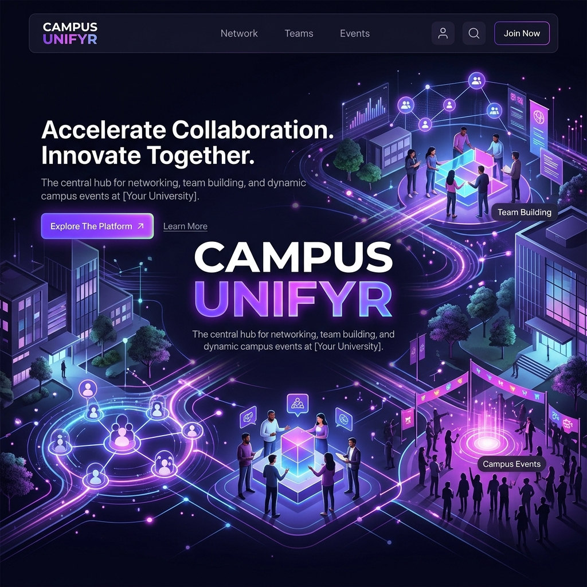

# Campus Unifyr — BMSCE Team Discovery & Collaboration



> **Accelerate Collaboration. Innovate Together.**  
> The premier team-finding and event discovery platform for **BMS College of Engineering** students.

[](https://campusunifyr.vercel.app)
[](https://nodejs.org)
[](https://reactjs.org)

---

## 🌟 Overview

**Campus Unifyr** is a high-performance, real-time platform designed to bridge the gap between idea and execution for students at BMSCE. Whether you are looking for a backend developer for a hackathon, a lead singer for Utsav, or a project partner for a lab, Unifyr connects you with the right people at the right time.

### Key Features

-   🎯 **Radar Matchmaking:** Real-time, proximity-aware (campus-wide) teammate search.
-   🤖 **AI Event Recommendations:** Personalized event shortlists powered by **Llama 3.3** based on your skills and interests.
-   💬 **Live Pulse Messaging:** Real-time communication via Socket.io with persistence for team collaborations.
-   🎭 **Event Hub:** Discover live BMSCE campus events, hackathons, and cultural performances in one unified dashboard.
-   🛡️ **Campus Security:** Exclusive access for `@bmsce.ac.in` emails, secured by **Clerk**.
-   🚀 **PWA Support:** Install Unifyr on your mobile device for a native-like campus experience.

---

## 🛠️ Tech Stack

### Frontend
-   **Framework:** [React 19](https://react.dev/) + [Vite](https://vitejs.dev/)
-   **Styling:** Vanilla CSS + [Framer Motion](https://www.framer.com/motion/) (Animations)
-   **Auth:** [Clerk](https://clerk.com/) (Identity Management)
-   **Icons:** [Lucide React](https://lucide.dev/)
-   **Real-time:** [Socket.io-client](https://socket.io/docs/v4/client-api/)

### Backend
-   **Runtime:** Node.js (Express 5.2)
-   **Database:** [PostgreSQL](https://www.postgresql.org/) (via `pg`)
-   **Intelligence:** [Groq AI](https://groq.com/) (Llama-3.3-70b-versatile)
-   **Real-time:** [Socket.io](https://socket.io/)
-   **Security:** Helmet, HPP, Express Rate Limit

---

## 🚀 Getting Started

### Prerequisites
-   Node.js >= 20.0.0
-   PostgreSQL instance

### Installation

1.  **Clone the repository:**
    ```bash
    git clone https://github.com/nikhil-m-star/unifyr.git
    cd unifyr
    ```

2.  **Environment Setup:**
    -   Configure `client/.env.local` (see `client/.env.example`)
    -   Configure `server/.env` (see `server/.env.example`)

3.  **Install Dependencies:**
    ```bash
    # Install for both client and server
    cd client && npm install
    cd ../server && npm install
    ```

4.  **Database Migration:**
    ```bash
    cd server
    npm run init-db
    ```

5.  **Run Locally:**
    ```bash
    # Terminal 1 (Backend)
    cd server && npm run dev

    # Terminal 2 (Frontend)
    cd client && npm run dev
    ```

---

## 🌍 Deployment

### Backend (Render)
1.  Connect this repo to **Render** as a "Web Service".
2.  Set **Root Directory** to `server`.
3.  Add required ENV variables (`DATABASE_URL`, `CLERK_SECRET_KEY`, `GROQ_API_KEY`, etc.).

### Frontend (Vercel)
1.  Connect this repo to **Vercel**.
2.  Set **Root Directory** to `client`.
3.  Set `VITE_API_ORIGIN` to your Render service URL.

---

## 📜 License & Acknowledgments

-   Built for the students of **BMS College of Engineering**.
-   Core Developer: **Nikhil M**
-   Powered by the spirit of **Utsav** and BMSCE innovation.

---

<p align="center">Made with 💜 for BMSCE</p>
